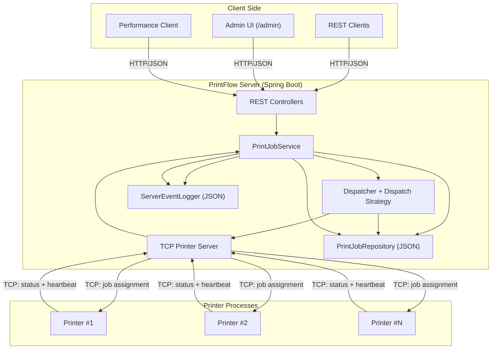

# Prototyp-Skizze „PrintFlow“

## Übersicht

„PrintFlow“ ist ein verteilter Druckauftragsmanager zur Verwaltung und parallelen Bearbeitung von Druckaufträgen.

Ein Spring-Boot-Server stellt eine REST-Schnittstelle für das Anlegen, Abrufen und Stornieren von Druckaufträgen bereit und kommuniziert über TCP-Sockets mit mehreren simulierten Druckerprozessen, die Aufträge parallel ausführen.

## Beschreibung

Druckaufträge werden von Clients (Web-Frontend oder Skripte) über eine REST-API an den PrintFlow-Server gesendet, dort in einer threadsicheren Warteschlange abgelegt und von einem zentralen Dispatcher an verfügbare Druckerprozesse verteilt.

Jeder Druckerprozess bearbeitet die ihm zugewiesenen Aufträge, meldet Statusänderungen und den Abschluss über die Socket-Verbindung zurück. Der Server aktualisiert den Auftragsstatus und stellt ihn über die REST-API bereit.

Ein separater Performance-Client simuliert viele gleichzeitige Druckaufträge, misst Antwortzeiten und Durchsatz.

## Architektur

## Funktionale Anforderungen

### REST-API für Druckaufträge (Clients)

- Clients können einen Druckauftrag anlegen (`POST`), inklusive Druckdatei-Referenz, Ziel-Druckerprofil (z. B. farbig/schwarzweiß, Papierformat), Priorität und optionaler Benutzerkennung.
- Clients können alle ihre Druckaufträge oder einzelne Aufträge nach ID abrufen, inklusive Status:
  - geplant
  - in der Warteschlange
  - wird gedruckt
  - abgeschlossen
  - fehlgeschlagen
  - storniert
- Clients können einen noch nicht gestarteten oder gerade wartenden Auftrag stornieren. Der Dispatcher entfernt den Auftrag aus der Warteschlange oder markiert ihn als „storniert“.
- Clients können nach Abschluss eines Druckauftrags ein Ergebnis bzw. einen Report abrufen, z. B. mit:
  - Druckdauer
  - Ziel-Drucker
  - eventuellen Fehlermeldungen

### Verwaltung von Druckerressourcen (Administrator)

- Administratoren können simulierte Druckerprozesse im System registrieren, mit Eigenschaften wie:
  - Name
  - Druckkapazität in Seiten pro Minute
  - unterstützte Formate
  - Verbindungskonfiguration (Host/Port)
- Administratoren können Drucker als „online“ oder „offline“ setzen. Der Dispatcher berücksichtigt nur aktive Drucker bei der Verteilung.
- Administratoren können die Verteilungsstrategie konfigurieren, z. B.:
  - Round-Robin
  - Least-Loaded-First
  - Prioritäten nach Auftragstyp

### Systeminterne Abläufe (Dispatcher und Druckerprozesse)

- Der Dispatcher verwaltet alle eingehenden Druckaufträge in einer threadsicheren Warteschlange. Einfügen, Entnehmen und Stornieren von Aufträgen sind atomar und thread-safe.
- Der Dispatcher verteilt Aufträge über TCP-Sockets an registrierte Druckerprozesse.
- Druckerprozesse holen aktiv Auftragspakete vom Dispatcher ab, führen die Drucksimulation aus und senden Statusupdates zurück, z. B.:
  - „Druck gestartet“
  - „Druck abgeschlossen“
  - „Fehler“
- Der Dispatcher protokolliert alle relevanten Ereignisse in einer Log-Datei:
  - Auftrag angelegt
  - Auftrag zugewiesen
  - Auftrag abgeschlossen
  - Auftrag storniert
  - Druckerfehler
  - Socket-Abbrüche
- Bei einem Druckerabsturz oder unerwarteten Verbindungsabbruch erkennt der Dispatcher den geschlossenen Socket, markiert alle noch offenen Aufträge dieses Druckers wieder als „offen“ und verteilt sie ohne Datenverlust neu.

### Performance-Client und Lastsimulation

- Ein Performance-Client kann eine definierte Menge an Druckaufträgen mit einer konfigurierbaren Rate (z. B. X Aufträge pro Sekunde) an die REST-API senden.
- Der Performance-Client misst für jeden Auftrag die Antwortzeit des Servers, z. B. die Zeit bis zur Bestätigung des Anlegens oder bis zur Statusantwort, und protokolliert Erfolg bzw. Fehler.
- Der Performance-Client kann Testszenarien mit unterschiedlicher Anzahl paralleler Druckerprozesse durchführen und den Durchsatz vergleichen:
  - gedruckte Seiten pro Sekunde
  - abgeschlossene Aufträge pro Minute

## Nichtfunktionale Anforderungen (NFA)

Es wird angenommen, dass PrintFlow-Server und Druckerprozesse auf einem handelsüblichen Laptop mit mehrkerniger CPU ausgeführt werden.

- Der PrintFlow-Server beantwortet korrekte REST-Anfragen zu Druckaufträgen zu mehr als 99,9 % ohne internen Fehler (`5xx`).
- Bei einer Rate von weniger als 50 REST-Anfragen pro Sekunde (Anlegen, Statusabfragen, Stornierungen) beantwortet der Server jede Anfrage in unter 0,2 Sekunden.
- Bei einer Last von 40 REST-Anfragen pro Sekunde und mindestens vier gleichzeitig verbundenen Druckerprozessen darf die p95-Antwortzeit der REST-Anfragen 500 ms nicht überschreiten. Dabei dürfen keine Druckaufträge verloren gehen oder doppelt vergeben werden.
- Bei mindestens 100 gleichzeitig ausgeführten Anlege-, Zuweisungs- und Stornierungsoperationen wird jeder Druckauftrag höchstens einem Drucker zugewiesen. Bereits gestartete Druckaufträge werden nicht nachträglich als storniert markiert; es gehen keine Statusänderungen verloren.
- Statusupdates, z. B. „Druck abgeschlossen“, werden innerhalb von maximal 2 Sekunden nach Abschluss des Druckvorgangs vom Druckerprozess über den Dispatcher an die REST-API ausgeliefert, sodass Clients den Abschluss zeitnah sehen.
- Der Systemdurchsatz abgeschlossener Druckaufträge pro Sekunde mit zwei aktiven Druckern ist mindestens 60 % höher als mit einem einzelnen Drucker unter Verwendung desselben Testauftrag-Sets.
- Der PrintFlow-Server ist innerhalb von 15 Sekunden nach dem Start bereit, REST-Anfragen und Socket-Verbindungen der Druckerprozesse anzunehmen. Das Programm ist bereits gebaut.

## Verteilung und Nebenläufigkeit

### Nebenläufigkeit

- Multithreading im Server für:
  - Verarbeitung von REST-Requests über einen Thread-Pool
  - Warteschlangenoperationen
  - Socket-Kommunikation mit den Druckerprozessen
- Parallele Bearbeitung der Druckaufträge in mehreren Druckerprozessen.
- Jeder Druckerprozess arbeitet jeweils mit einem internen Thread-Pool, beispielsweise zur Simulation mehrerer Druckjobs parallel.

### Verteilung

- Die Spring-Boot-Anwendung „PrintFlow-Server“ fungiert als zentrale Instanz mit REST-API und Dispatcher-Komponente.
- Mehrere eigenständige Druckerprozesse kommunizieren über TCP-Sockets mit dem Server und können theoretisch auf separaten Rechnern laufen.
- Der Performance-Client ist eine separate Anwendung, die über HTTP mit dem PrintFlow-Server kommuniziert und Messdaten sammelt.

### Komponenten

- REST-Controller für Druckaufträge (Spring Boot)
- Service-Klasse für die Auftragslogik
- Dispatcher-Komponente mit threadsicherer Warteschlange
- Repository bzw. Storage für Auftragsstatus und Logs
- Druckerprozesse als Java-Anwendungen mit Socket-Client, die:
  - Aufträge empfangen
  - Drucksimulationen ausführen
  - Ergebnisobjekte zurücksenden
- Performance-Client mit:
  - Konfigurationsmodul für Lastprofile
  - Reporting-Modul für Messwerte

## Lastsimulation und Test der nichtfunktionalen Anforderungen

### Übersicht NFA und Überprüfung

| Nichtfunktionale Anforderung | Überprüfung |
|---|---|
| Server beantwortet korrekte REST-Anfragen zu mehr als 99,9 % ohne interne Fehler (`5xx`) | Serverseitiges Logging unterscheidet `4xx`- von `5xx`-Antworten. Der Performance-Client sendet über mehrere Minuten eine definierte Menge gültiger Anfragen; der Server loggt Gesamt- und Fehleranzahl. Anschließend wird das Verhältnis berechnet. |
| Antwortzeit unter 0,2 s bei weniger als 50 REST-Anfragen pro Sekunde | Der Performance-Client sendet Anfragen getaktet mit konfigurierter Rate, misst per Zeitstempel die Latenz jeder Anfrage und zählt Anfragen mit überschrittener Schwelle. |
| Dynamische Mehrkernauslastung | Parallelisierte Tasks (REST-Handler, Dispatcher-Threads, Socket-Handler) loggen ihre Thread-IDs. Nach einem Lasttest wird die Verteilung der Tasks pro Thread ausgewertet; eine gleichmäßige Verteilung gilt als Nachweis. |
| Atomare und thread-sichere Auftragsvergabe bzw. Stornierung | Der Performance-Client führt 100 gleichzeitig ausgeführte, gemischte Operationen zum Anlegen, Abrufen, Zuweisen und Stornieren von Druckaufträgen durch. Anschließend wird geprüft, dass jeder Auftrag höchstens einem Drucker zugewiesen wurde, gestartete Aufträge nicht storniert wurden und keine Statusänderungen verloren gingen. |
| Statusupdates innerhalb von 2 Sekunden | Ein Testauftrag wird überwacht. Der Druckerprozess protokolliert den Zeitpunkt des Abschlusses, der Server den Zeitpunkt des Statusupdates für den Client. Die Differenz wird gemessen und darf 2 Sekunden nicht überschreiten. |
| Mindestens 60 % Durchsatzsteigerung mit zwei Druckern gegenüber einem Drucker | Ein festes Set von Druckaufträgen wird zunächst mit einem, dann mit zwei Druckern abgearbeitet. Der Dispatcher loggt Start- und Endzeit sowie die Anzahl verarbeiteter Aufträge; daraus werden Durchsatz und relative Steigerung berechnet. |
| Serverstart in weniger als 15 Sekunden | Spring-Boot-Startup-Logs geben die Startzeit aus. Zusätzlich sendet ein Testclient unmittelbar nach dem Prozessstart einen Dummy-Request, misst die Zeit bis zur ersten erfolgreichen Antwort und verifiziert, dass die 15-Sekunden-Grenze eingehalten wird. |
|